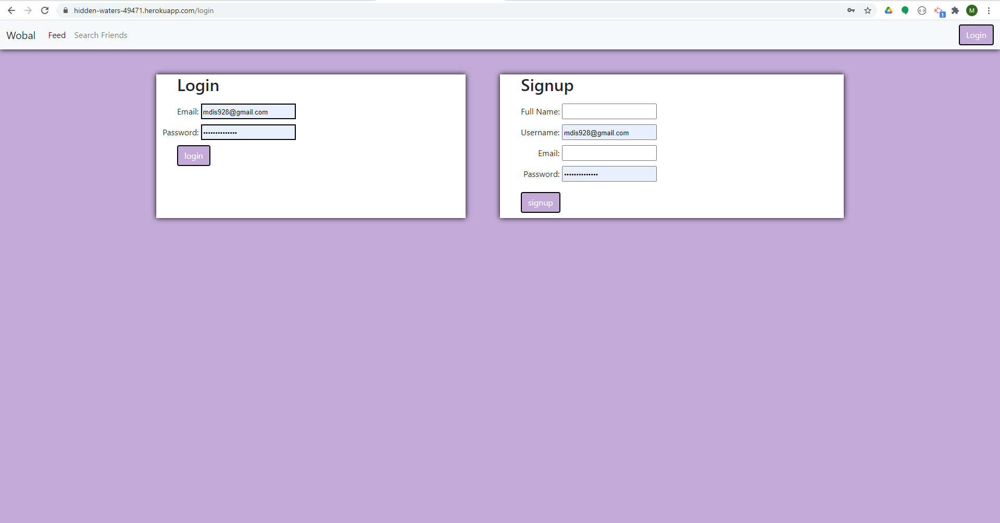
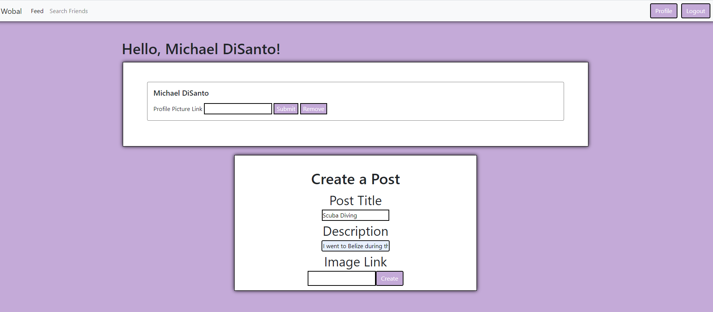
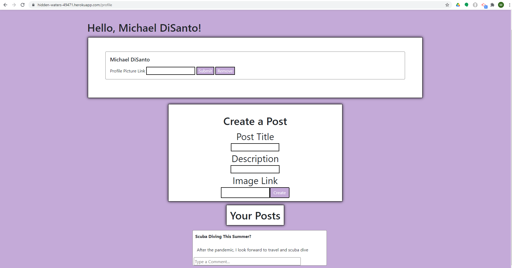
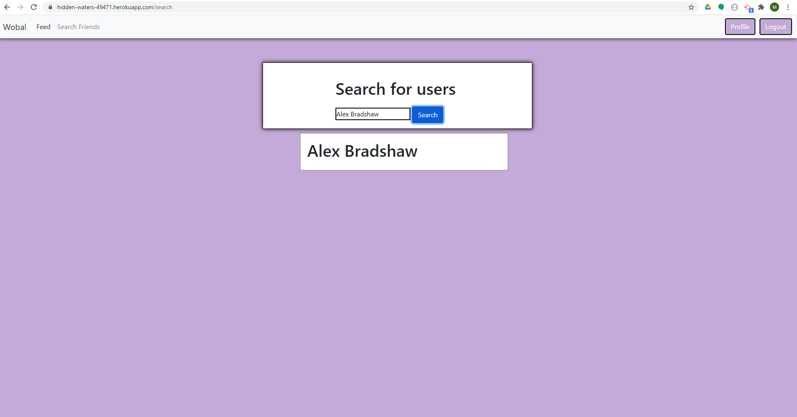
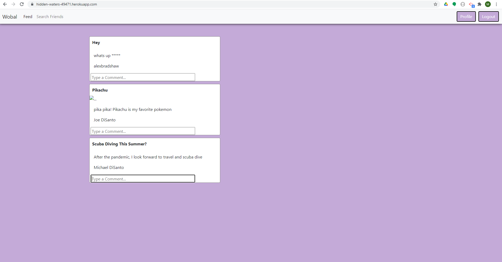

# Wobal - Project 2
https://github.com/alexbradshaw/Wobal

## Deployed App
https://hidden-waters-49471.herokuapp.com/

## Description
For this project, we are required to create our first full application. Our team decided to create a social media site called Wobal for only your close friends and family. We needed to use MVC, server-side API, user authentication, and connect to a MySql 

## Table of Contents
- [Installation](#installation)
- [Usage](#usage)
- [License](#license)
- [Contributing](#contributing)
- [Tests](#tests)
- [Questions](#questions)
## Installations
bcrypt, connect-session-sequelize, dotenv, eslint, express, express-handlebars express-session, mysql2, nodemon, sequelize, insomnia (testing routes)

### Demo

## Usage

## License
Copyright (c) 2021 Alex Bradshaw, Michael DiSanto, Bill Pate

Permission is hereby granted, free of charge, to any person obtaining a copy of this software and associated documentation files (the "Software"), to deal in the Software without restriction, including without limitation the rights to use, copy, modify, merge, publish, distribute, sublicense, and/or sell copies of the Software, and to permit persons to whom the Software is furnished to do so, subject to the following conditions:

The above copyright notice and this permission notice shall be included in all copies or substantial portions of the Software.

THE SOFTWARE IS PROVIDED "AS IS", WITHOUT WARRANTY OF ANY KIND, EXPRESS OR IMPLIED, INCLUDING BUT NOT LIMITED TO THE WARRANTIES OF MERCHANTABILITY, FITNESS FOR A PARTICULAR PURPOSE AND NONINFRINGEMENT. IN NO EVENT SHALL THE AUTHORS OR COPYRIGHT HOLDERS BE LIABLE FOR ANY CLAIM, DAMAGES OR OTHER LIABILITY, WHETHER IN AN ACTION OF CONTRACT, TORT OR OTHERWISE, ARISING FROM, OUT OF OR IN CONNECTION WITH THE SOFTWARE OR THE USE OR OTHER DEALINGS IN THE SOFTWARE.

## Contributors 
Github Users
- [mdis928](https://github.com/mdis928)
- [alexbradshaw](https://github.com/alexbradshaw) 
- [minprocess](https://github.com/minprocess)

## Test
To perform a test, please make sure the dependencies are installed. Once you have them installed, you should be able to do "node server.js" in the terminal. Then go to your browsers and connect to local host. You should see your application. You can test the functionality and if something is wrong, play around with the code so you can get the functionality down right. If you want test the GET, POST, PUT, and DELETES routes, you can use insomnia 

## Questions
Please contact us via github mdis928, alexbradshaw, minprocess
